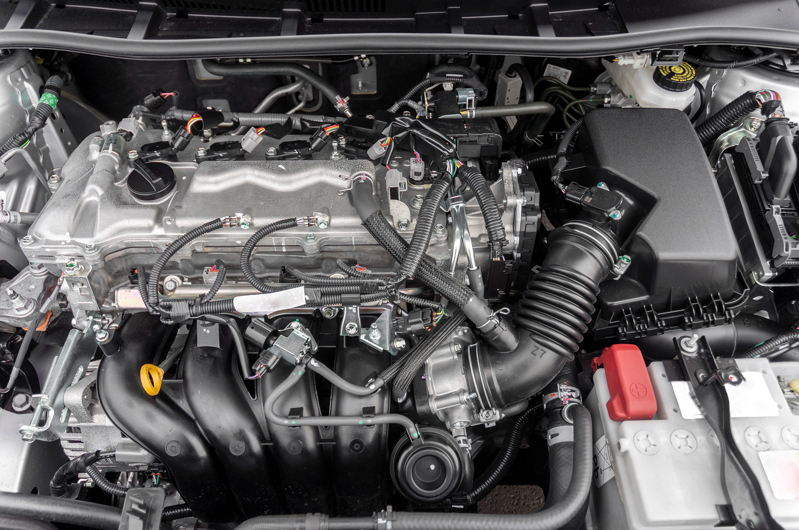

```{r setup, include=FALSE}
options(htmltools.dir.version = FALSE)
knitr::opts_chunk$set(comment = "#",
                      message = FALSE,
                      warning = FALSE, 
                      collapse = TRUE,
                      fig.retina= 3,
                      fig.align = "center",
                      fig.path = "figs/01")

#xaringanExtra::use_panelset()
xaringanExtra::use_extra_styles(
  hover_code_line = TRUE,
  mute_unhighlighted_code = TRUE
)
```

class: title-slide, top, left

<div class="hbar"></div>

<br/>

# `r rmarkdown::metadata$title`

## `r rmarkdown::metadata$subtitle` &ndash; Module `r stringr::str_pad(rmarkdown::metadata$module, 2, pad = "0")`

### `r rmarkdown::metadata$author` 

---
class: middle, center
background-color: #404040

## .big-text[Hello.]

---
class:inverse-blue, middle, center

# What are R and RStudio?

---
class: middle, center

.pull-left[


```{r echo=FALSE, out.extra="class=external"}

```

### Engine
]

.pull-right[


```{r echo=FALSE, out.extra="class=external"}
knitr::include_graphics("images/module/01/shutterstock/car_wheel.jpg")
```

### Dashboard
]

---
class: middle, center

## .display[R] is a programming language that runs R code

--

## .display[RStudio] is an .em[integrated development environment (IDE)] that provides an interface by adding many convenient features and tools

---

class: top, center

### RStudio: Console


---

class: inverse-green, middle, center

# How do I code in R?

---
class: middle, center, frame

# .center[Values]

--

## .display[Numeric] &rarr; `1`

--

## .display[Character] &rarr; `"Foo"`

---
name: console-basics
class: middle, frame

# .center[Console Basics]

--

```r
> 2 + 2
[1] 4
```

---

template: console-basics

```r
> 2 + 2
[1] 4

> 7:35
 [1]  7  8  9 10 11 12 13 14 15 16 17 18 19 20 21 22 23 24 25 26 27 28 29 30 31
[26] 32 33 34 35
```

---

template: console-basics

```r
> 2 + 2
[1] 4

> 7:35
 [1]  7  8  9 10 11 12 13 14 15 16 17 18 19 20 21 22 23 24 25 26 27 28 29 30 31
[26] 32 33 34 35

> 5 -
+ 
+ 1
[1] 4
```

---
class: middle, center, frame

# Objects

--

## .em[What is an object?] Just a name that you can use to call up stored data.

---
class: top, center, frame
background-image: url(images/module/01/r_object_simple.png)
background-size: 900px
background-position: center

# Objects

---
class: top, center, frame
background-image: url(images/module/01/r_object_multiple.png)
background-size: 700px
background-position: center

# Objects

---
class: top, center
### RStudio: Environment 


---

class: top, center, frame
background-image: url(images/module/01/r_functions.png)
background-size: 700px
background-position: center

# Functions


---
class:middle, center, frame

# Errors, Warnings, and Messages

--

## Error in…, Error:

--

## Warning:  

???

R reports .red[**Errors**], .red[**Warnings**], and .red[**Messages**] in a glaring red font
 
**Errors:** When the red text is a legitimate error, it will be prefaced with "Error in…" and will try to explain what went wrong. Generally when there’s an error, the code will not run.

**Warnings:** When the red text is a warning, it will be prefaced with "Warning:" and R will try to explain why there’s a warning. Generally your code will still work, but with some caveats.

**Messages:** When the red text doesn’t start with either "Error" or "Warning", it’s just a friendly message.
---
class:inverse-blue2, middle, center

# What are R packages?

---
class: middle, center

.pull-left[

## .display[R]

]

.pull-right[

## .display[R Packages]

]

---
class: top, center, frame
background-image: url(images/module/01/r_packages_default.png)
background-size: 240px
background-position: center

# Base R

---

class: top, center,frame

# Extending

```{r echo=FALSE}

```

---
class: top, center

<https://cran.r-project.org/>


---
class: top, center, frame

# Using Packages

--

.pull-left[

## .display[1]

```{r eval=FALSE}
install.packages("foo")
```

**Downloads files to computer**

]

--

.pull-right[

## .display[2]

```{r eval=FALSE}
library(foo)
```

**Loads package**
]

---
class: inverse-purple, middle, center

# Getting Help with Help Pages

---

class: middle, center, frame

# Help

--
## `help()` and `?`

---
class: top, center

### RStudio: Help 


???

**Description** - A short summary of what the function does.

**Usage** - An example of how you would type the function. Each argument of the function will appear in the order R expects you to supply it (if you don’t use argument names).

**Arguments** - A list of each argument the function takes, what type of information R expects you to supply for the argument, and what the function will do with the information.

**Details** - A more in-depth description of the function and how it operates. The details section also gives the function author a chance to alert you to anything you might want to know when using the function.

**Value** - A description of what the function returns when you run it.

**See Also** - A short list of related R functions.

**Examples** - Example code that uses the function and is guaranteed to work. The examples section of a help page usually demonstrates a couple different ways to use a function. This helps give you an idea of what the function is capable of.

---
background-color: #EE342A
background-image: url(images/module/01/LillyLogo_White.png)
background-size: 600px 420px
background-position: center
